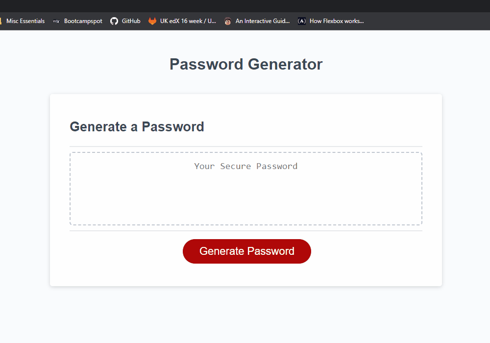

# Password Generator

# Description

This application allows the user to generate a random password based on the criteria that they select through browser prompts. The prompts will ask for the required password length and then give options to include lowercase, uppercase, numeric, and special characters.

The generated password is guaranteed to have characters from all selected options, presented in a randomised order.

[Click here](https://codenamehaylz.github.io/Password-Generator/) to view the deployed application.

## Features
If the user inputs do not meet the requirements to generate a password, they will be alerted and prompted again. This will happen if the user enters a number less than 10 or more than 64, or if they do not accept at least one character type.

## License
MIT License.